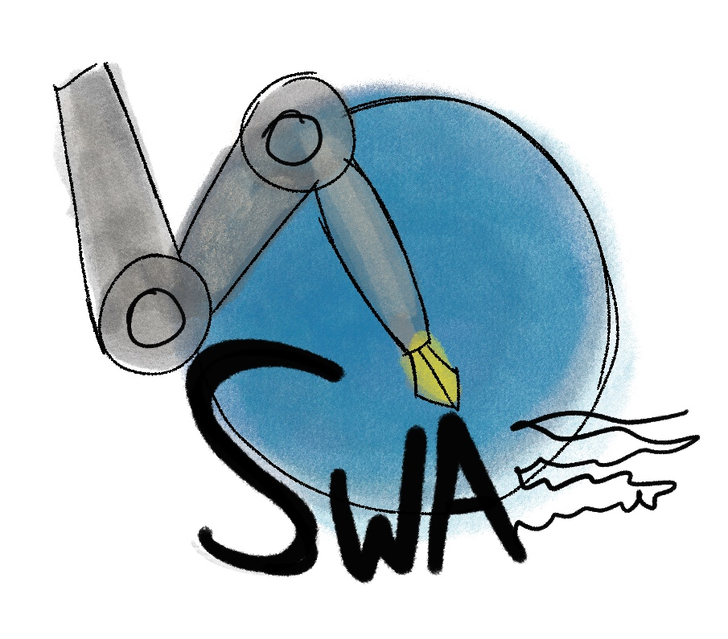
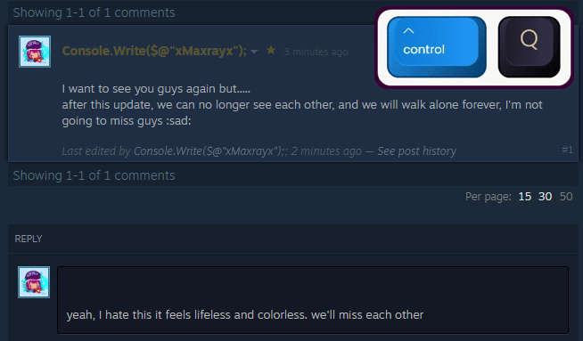
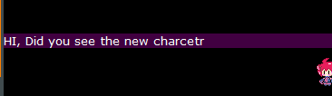
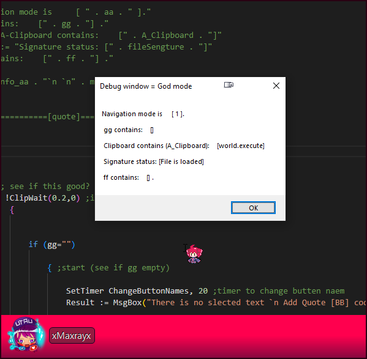
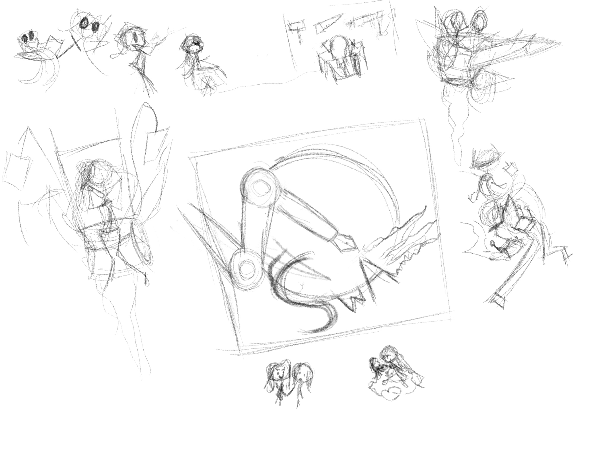

# Steam writing assistant (SWA)



a **Software** that makes writing in Steam forums more organized and fun

# Futures:

- Auto Quote

<p align="left" width="100%">
    <br>
    .  
</p>

<br><br>

- Auto Bold, Italic 

<p align="left" width="100%">
    <br>
      
</p>


* Customizable **Signature**

  

* Auto lower-case F10

  

* Auto-Translate to English (not yet)


# 	How to use 


# Hotkeys (new)

- **Q**uote `Ctrl + Q` or `Alt + Q` for "Quote".

- **B**old  `Ctrl + B` or `Alt + B` for "Bold".

- **I**talic  `Ctrl + I` or `Alt + I` for "quote".

- **S**poilers `Ctrl + S` or `Alt + S` for "quote".

- **H**orizontal line. `Ctrl + H`.

- **B**ulleted list (* * *) 

- **O**rder List

- One more slot list +**1** `Ctrl + 1`

- **C**od**e** `ALT+ C`  or `Ctrl  + E`

- **S**ignature `F1`

  

  # Hotkeys:

- `Ctrl + Q`  to do  . 
- `Ctrl + B` converts to Bold fonts.
- `Ctrl + I` converts to italic fonts.
- `Shift + Ctrl + I` & `Shift + Ctrl + B`  Bold + italic 
- `ctrl +S`  spoilers.
- `Ctrl + H`  insert a horizontal line.
- `ctrl + 3` Bulleted list.
- `ctrl + 2` order list.
- `ctrl + 1` one slot list
- `Alt + c`   code
- `Signature` F1  and  F5 to  refresh it  ``


# Debug menu

For devs or Expert users

- `God mode`:  press `F4`  to show God mode in the `Message box`





  ````mermaid

  mindmap
  root((Steam writing assistant))
  	Quote
  		Ctrl+Q	
  		Alt+Q
  	Bold
  		Ctrl+B
  		Alt+b
  	Italic
  		Ctrl+I
  		Alt+I
  	Spoilers
  		Ctrl+S
  	Horizontal line
  		Ctrrl+H
  	Bulleted list
  		Ctrl+3
  			One more slot list
  				Ctrl+1
  	Order list
  		Ctrl+4
  			One more slot list
  				Ctrl+1
  	Code
  		Alt+c
  		Ctrl+e
  	
  	
  
  ````


# Art History




# HTML test

.

jjjjkk<br>.


mml

mlmlml
